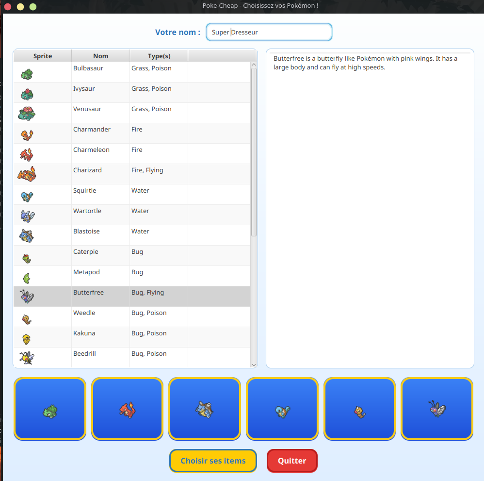
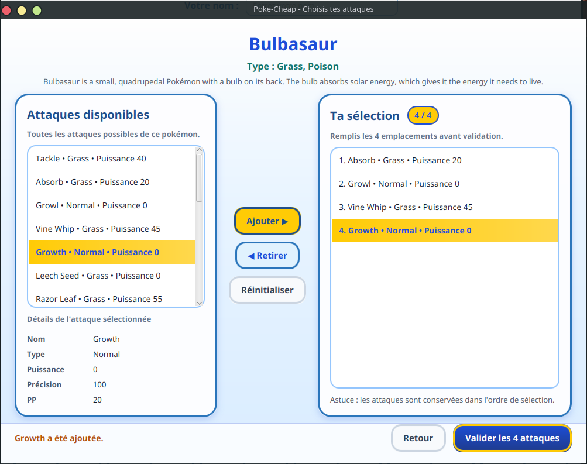
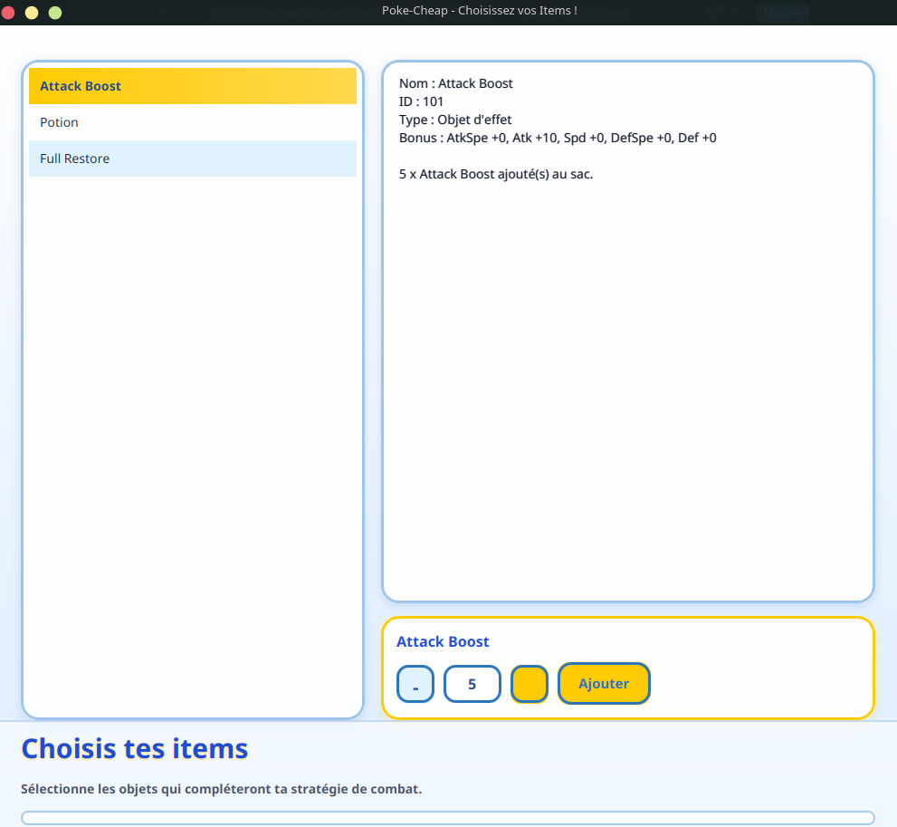
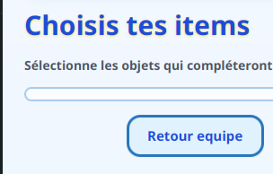
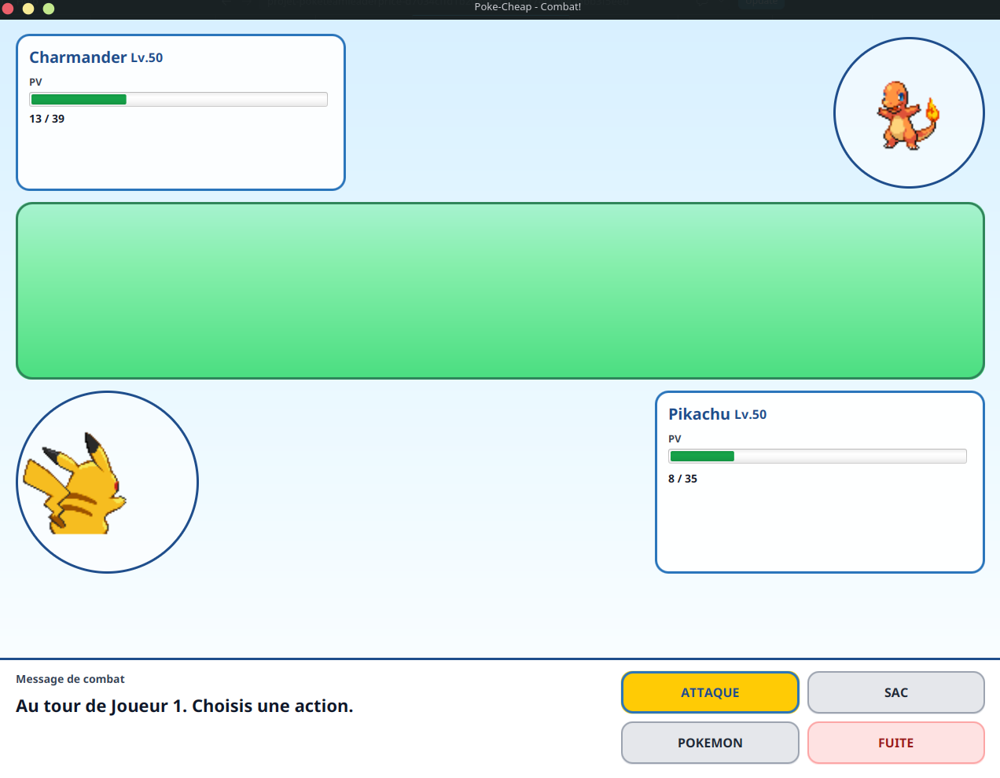
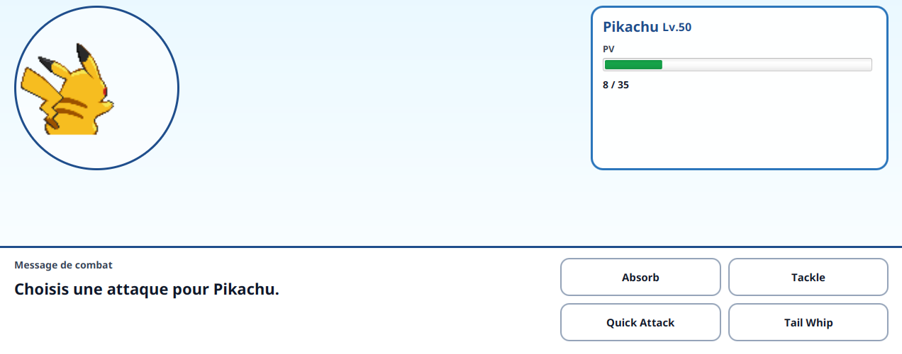
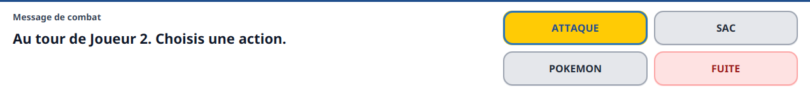

# Fiche rendu projet

> Ce document est un bilan destiné au client. Présentez ce qui a été livré, ce qui fonctionne, et tournez habilement ce qui manque. Pas de jargon technique — on parle de fonctionnalités et de valeur perçue.

## Rappel du projet

L'objectif du projet était de reproduire un système de combat pokemon, notamment les actions pour attaquer, utiliser un item, changer de pokemon et fuir. Chaque joueur choisit sa liste de pokemons et d'items puis chacun se connecte au Bus Azure, l'un hébergeant la partie, l'autre la rejoignant.

## Ce qui a été livré

### Fonctionnalité 1 — *Choisir ses pokemons*

### Fonctionnalité 2 — *Choisir les attaques pour chaque pokemon*

### Fonctionnalité 3 — *Choisir son nom de dresseur*

### Fonctionnalité 4 — *Choisir ses items*

### Fonctionnalité 5 — *Retour en arrière*

### Fonctionnalité 6 — *Lancement d'un combat*

### Fonctionnalité 7 — *Lancer une attaque*

### Fonctionnalité 8 — *Système de tour par tour*

## Ce qui n'a pas été livré (et pourquoi)

### Système en ligne via le Bus Azure

Le système de Bus Azure a été capricieux tout au long du projet. La fonctionnalité était complexe à intégrer, et demandait beaucoup plus de debogage que prévu. Nous avons donc dû passer sur une version hors ligne, avec une seule interface pour les deux joueurs.

A noter cependant que le système hors ligne utilise la même structure de code que la version avec le bus. De plus, nous avons laisser l'ensemble des éléments permettant de réaliser la version en ligne. Ainsi, le développement de cette fonctionnalité à l'avenir est garanti et prendra seulement un peu plus de temps.

### Les actions "Use Item", "Change Pokemon" et "Fuite"

### Detection d'un pokemon KO

### Ajout de musique / bruitage

## Perspectives

<!-- Quelles évolutions proposez-vous pour la suite ? -->

