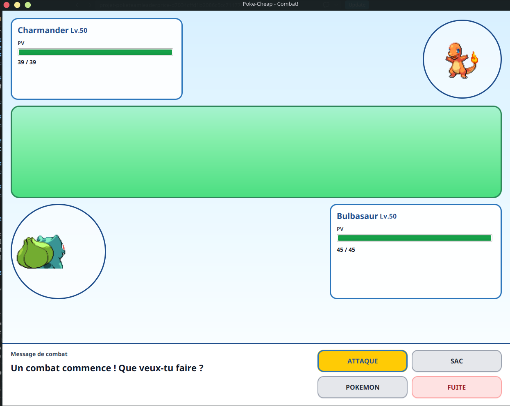
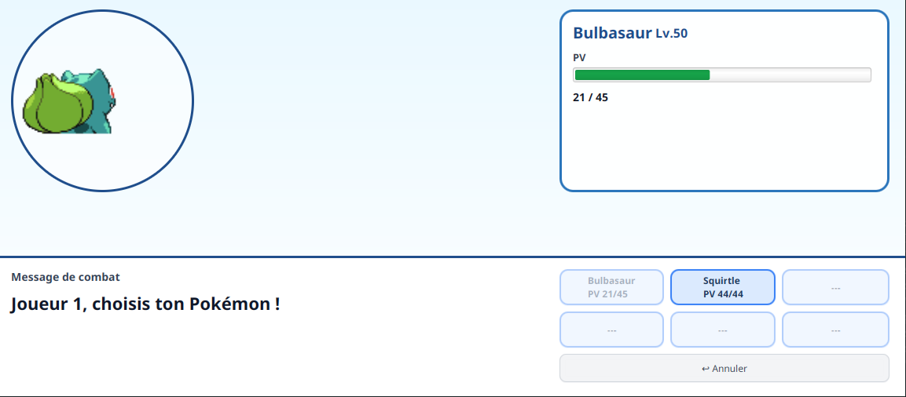
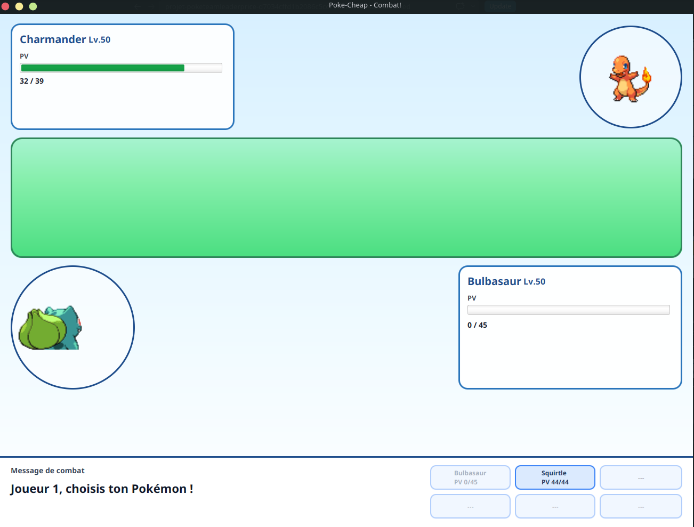
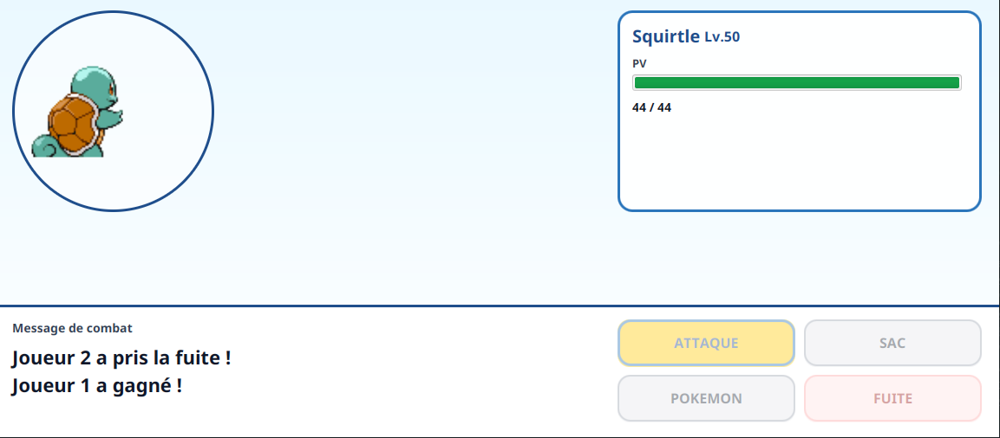
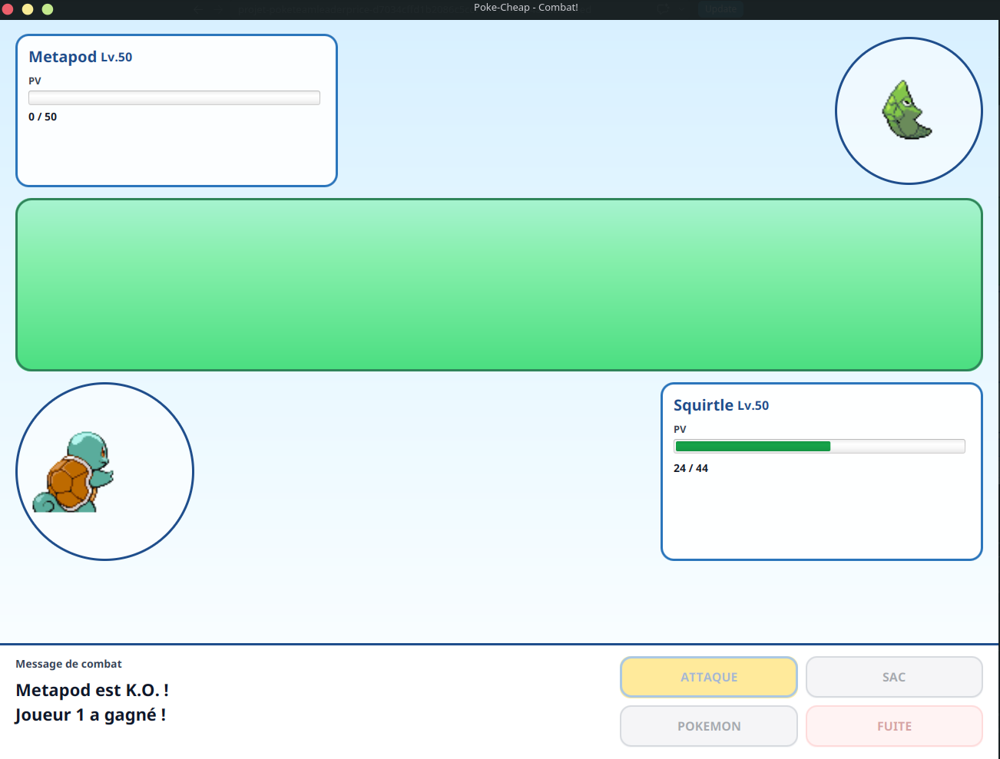

# Fiche rendu projet

> Ce document est un bilan destiné au client. Présentez ce qui a été livré, ce qui fonctionne, et tournez habilement ce qui manque. Pas de jargon technique — on parle de fonctionnalités et de valeur perçue.

## Rappel du projet

L'objectif du projet était de reproduire un système de combat pokemon, notamment les actions pour attaquer, utiliser un item, changer de pokemon et fuir. Chaque joueur choisit sa liste de pokemons et d'items puis chacun se connecte au Bus Azure, l'un hébergeant la partie, l'autre la rejoignant.

## Ce qui a été livré

### Fonctionnalité 1 — *Choisir ses pokemons*
Avant de commencer un combat, chaque joueur doit sélectionner ses pokemons via une liste. Celle-ci permet de voir les détails du pokemon, notamment sa petite description.

### Fonctionnalité 2 — *Choisir les attaques pour chaque pokemon*
Pour chaque pokemon, le joueur doit choisir les attaques qu'il pourra utiliser. L'interface propose des éléments décrivant chaque attaque. On peut en ajouter, en retirer. Jusqu'à quatre attaques par pokemon.

### Fonctionnalité 3 — *Choisir son nom de dresseur*
On peut choisir le nom de son dresseur avant de passer aux items. C'est celui qui sera affiché dans l'interface pour les messages.

### Fonctionnalité 4 — *Choisir ses items*
Chaque joueur peut ajouter jusqu'à 20 items parmis une liste.

### Fonctionnalité 5 — *Retour en arrière*
A n'importe quel moment avant la validation d'un joueur, on peut revenir en arrière pour changer les pokemons / le nom du joueur.

### Fonctionnalité 6 — *Lancement d'un combat*
Une fois les deux joueurs remplis, on peut commencer un combat.

### Fonctionnalité 7 — *Lancer une attaque*
Parmis les quatre attaques du pokemon actif, le joueur peut en choisir une à lancer.

### Fonctionnalité 8 — *Système de tour par tour*
Une fois que le joueur a jouer, l'autre joueur prend la main. Les joueurs jouent sur la même interface.

### Fonctionnalité 9 — *Changement de pokemon actif*
Pendant son tour, un joueur peut changer son pokemon actif. Les points de vie des pokemons sont sauvegardés lorsque ceux-ci passent d'actif à pokemon de banc (ceux non actifs). Un pokemon KO ne peut pas rentrer en pokemon actif. Cette action consomme le tour du joueur.

### Fonctionnalité 10 — *Pokemon KO*
Lorsqu'un pokemon est KO, deux cas se présentent :
- si le joueur a un autre pokemon non KO, il doit le sélectionner (cf: fonctionnalité 9)
- si le joueur n'a plus de pokemon non KO, il perd et la partie est finie (cf: fonctionnalité 12)  

### Fonctionnalité 11 — *Fuite*
Durant son tour, le joueur peut décider de fuir. C'est un abandon, le joueur adverse gagne la partie (cf: fonctionnalité 12)

### Fonctionnalité 12 — *Fin de partie*
Lorsqu'un joueur fuit ou n'a plus de pokemon non KO, l'autre joueur gagne la partie.

## Ce qui n'a pas été livré (et pourquoi)

Principalemnent, c'est le debogage du bus azure qui nous aura posé problème. Notamment en termes de temps perdu. Les autres fonctionnalités n'ont pas été réalisé parce qu'il fallait que le bus fonctionne pour développer et tester les autres éléments.

### Système en ligne via le Bus Azure

Le système de Bus Azure a été capricieux tout au long du projet. La fonctionnalité était complexe à intégrer, et demandait beaucoup plus de debogage que prévu. Nous avons donc dû changer de cap vers la fin du projet pour une version hors ligne, avec une seule interface pour les deux joueurs.

A noter cependant que le système hors ligne utilise la même structure de code que la version avec le bus. De plus, nous avons laisser l'ensemble des éléments permettant de réaliser la version en ligne. Ainsi, le développement de cette fonctionnalité à l'avenir est garanti et prendra seulement un peu plus de temps, et pourra être développée comme un ajout (possibilité de faire hors-ligne ou en ligne).

### L'action "Use Item"

Cette action n'a pas été finie, notamment par sa complexité (différents items, effets distincts, modifications de plusieurs statistiques d'un même pokemon...) et n'est donc pas disponible pour le moment. Cependant, toute la structure pour l'intégrer est en place, et son développement n'est qu'une question de temps.

### Le choix du stade

Cette action n'était pas essentielle au bon fonctionnement du jeu. Nous ne nous y sommes pas attardé, mais il suffit de rajouter une petite fenêtre pour le choisir, puis de mettre à jour les graphismes de l'interface de combat.

### Ajout de musique / bruitage

Nous ne nous sommes pas concentré particulièrement sur cette fonctionnalité, qui relève plus de l'estétique que d'une fonctionnalité technique.

La structure du code permet facilement de rajouter les éléments nécessaires à l'activation du son pour un partie, où encore des bruitages.

## Perspectives

