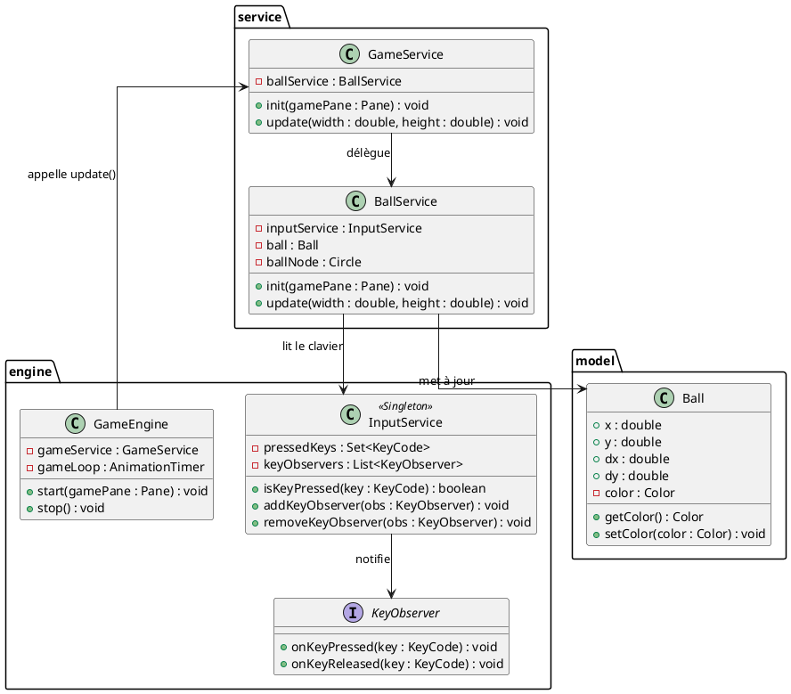
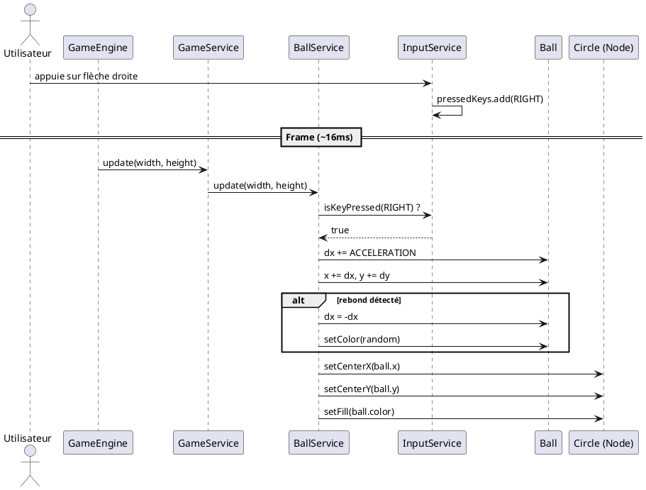

# Conception technique

> Ce document décrit l'architecture technique de votre projet. Vous êtes dans le rôle du lead-dev / architecte. C'est un document technique destiné à des développeurs.

## Vue d'ensemble

L'application est structurée en trois couches :

1. **Engine** (socle fourni) — Boucle de jeu (`GameEngine`), gestion du clavier (`InputService`), interface observer (`KeyObserver`).
2. **Service** — Logique métier. `GameService` orchestre le jeu, `BallService` gère la balle (modèle, vue, physique, événements).
3. **Model** — Données pures. `Ball` stocke la position, la direction et la couleur.

L'injection de dépendances (Guice) câble automatiquement les services entre eux. `GameEngine` reçoit `GameService`, qui reçoit `BallService`, qui reçoit `InputService`.

```
GameEngine  →  GameService  →  BallService  →  InputService
   (engine)      (service)       (service)        (engine)
```

Le rendu est géré par le Scene Graph JavaFX : chaque élément visuel est un Node (`Circle`, `Text`) ajouté au `Pane`. Pas de méthode `render()` manuelle.

## Design Patterns

### DP 1 — Singleton

**Feature associée** : Gestion centralisée du clavier (InputService)

**Justification** : L'état des touches pressées doit être unique et partagé entre tous les services qui lisent le clavier. Si chaque service avait sa propre instance d'`InputService`, ils auraient des vues incohérentes de l'état du clavier. Le Singleton garantit une source de vérité unique. L'alternative (passer l'état par paramètre) serait lourde et fragile.

**Intégration** : `InputService` est annoté `@Singleton` (Guice). Tous les services qui en ont besoin le déclarent dans leur constructeur `@Inject` et reçoivent la même instance.

### DP 2 — Observer

**Feature associée** : Réaction aux événements clavier (tir, saut, actions ponctuelles)

**Justification** : Le polling (vérifier à chaque frame si une touche est pressée) convient pour le mouvement continu, mais pas pour des actions ponctuelles comme un tir ou un saut. L'Observer permet à n'importe quel composant de s'abonner aux événements clavier et de réagir instantanément, sans coupler `InputService` aux composants qui l'écoutent. C'est plus extensible qu'un `switch/case` centralisé.

**Intégration** : `KeyObserver` est une interface avec `onKeyPressed(KeyCode)` et `onKeyReleased(KeyCode)`. Les composants l'implémentent et s'enregistrent via `inputService.addKeyObserver(...)`. `InputService` notifie tous les observers à chaque événement clavier.

### DP 3 — Strategy

**Feature associée** : Comportement de rebond interchangeable

**Justification** : On veut pouvoir changer la façon dont la balle rebondit (rebond simple, rebond avec absorption d'énergie, rebond aléatoire) sans modifier `BallService`. Le pattern Strategy permet d'encapsuler chaque algorithme de rebond dans une classe séparée et de les interchanger à l'exécution. L'alternative (un `if/else` dans `update()`) violerait le principe Open/Closed.

**Intégration** : Une interface `BounceStrategy` avec une méthode `applyBounce(Ball ball, double width, double height)`. Chaque stratégie (`SimpleBounce`, `DampedBounce`, `RandomBounce`) l'implémente. `BallService` reçoit une `BounceStrategy` par injection et l'appelle dans `update()`. Le binding est déclaré dans `AppModule`.

### DP 4 — Factory

**Feature associée** : Création de balles avec des configurations variées

**Justification** : Quand on ajoute le mode multi-balles, on veut créer des balles de différents types (petite/rapide, grosse/lente, avec traînée) sans exposer la logique de construction. La Factory centralise la création et garantit la cohérence (une balle "rapide" a toujours les bons paramètres). L'alternative (des `new Ball(...)` éparpillés) rendrait les changements de paramètres difficiles à maintenir.

**Intégration** : Une classe `BallFactory` avec des méthodes `createDefault()`, `createFast()`, `createHeavy()` qui retournent des `Ball` préconfigurées. `BallService` (ou un futur `MultiBallService`) utilise la factory au lieu d'appeler `new Ball(...)` directement.

## Diagrammes UML

### Diagramme 1 — Diagramme de classes (architecture globale)



### Diagramme 2 — Diagramme de séquence (une frame de jeu)


