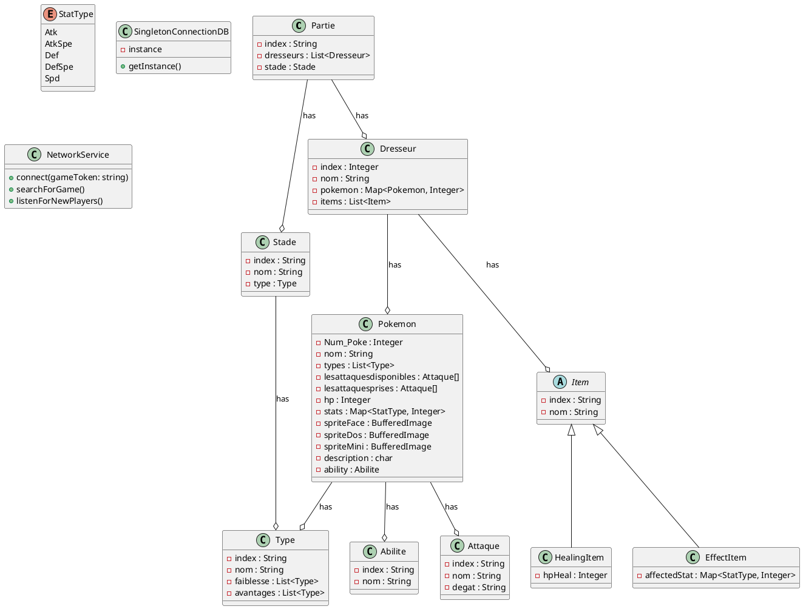

# Conception technique

> Ce document décrit l'architecture technique de votre projet. Vous êtes dans le rôle du lead-dev / architecte. C'est un document technique destiné à des développeurs.

## Vue d'ensemble

<!-- Décrivez les grandes briques de votre application et comment elles communiquent. Un schéma d'architecture est bienvenu. -->

## Design Patterns

### DP 1 — *Singleton*

**Feature associée** : Connexion BDD

**Justification** : utilisé pour garantir qu'il n'existe qu'une seule instance de connexion à la base de données à tout moment. Cela évite la création répétitive de connexions, ce qui peut être coûteux en termes de ressources et de performance. Si une connexion est déjà ouverte, elle peut être réutilisée, assurant ainsi une gestion efficace des ressources.

**Intégration** : La classe permettant la connexion à la base de données intègrera le pattern Singleton. Cette classe sera responsable de la création et de la gestion de l'instance unique de connexion.

### DP 2 — *Observer*

**Feature associée** : Connexion à internet pour les parties + les évenements claviers/sonores

**Justification** : Tous ces éléments étant asynchrone, il faut qu'un élément du code attende qu'un événement se produise pour activer certains comportements. Un observeur nous permettra d'attendre "en arrière plan" (le code ne s'arrête pas pendant l'attente) qu'un évenement se produise pour activer du son / des images / la réception d'une connexion

**Intégration** : une classe Observer permettra d'handle les attentes des autres objets et d'appeller des comportements.

### DP 3 — *Mediator*

**Feature associée** : Lancement et gestion d'une Partie

**Justification** : Une partie gère les interactions entre les objets (dresseurs, objets, pokemon, terrain). Au niveau du code, il serait étrange qu'une attaque d'un pokemon permette à celui-ci de directement prendre la barre de vie de son adversaire et de lui enlever des points... Il serait préférable de gérer les interactions au sein d'une classe spécifique, pour alléger le nombre de méthodes spécifiques aux combat dans les objets.

**Intégration** : une classe Combat, intégrant une liste de dresseurs, de pokemon, d'objets et un terrain.

### DP 4 — *Command*

**Feature associée** : Permettre de centraliser l'execution des actions "attaquer", "utiliser un objet", "abandonner", "changer de pokemon actif"

**Justification** : il permet d'encapsuler une demande sous forme d'objet, permettant ainsi de paramétrer les clients avec différentes demandes, d'enregistrer ou de journaliser les demandes, et de supporter les opérations annulables. Cela simplifie l'organisation et l'évolutivité des commandes en centralisant leur exécution dans une classe spécifique.

**Intégration** : Une interface ICommande sera définie et implémentée dans chacune des quatre classes de commandes (attaquer, utiliser un objet, abandonner, changer de Pokémon actif). Chaque commande implémentera une méthode executer qui sera appelée par la classe Combat pour exécuter l'action correspondante.

## Diagrammes UML

### Diagramme 1 — *Type classe*

### Diagramme 2 — *Use Case*

