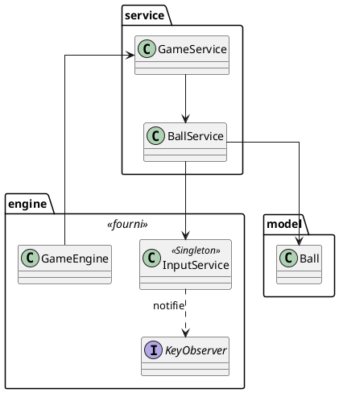

# Document de réversibilité technique

> Ce document est destiné à l'équipe qui reprendra la maintenance du projet. Soyez honnêtes et exhaustifs. Pas d'enjolivement.

## Architecture actuelle

Le projet suit une architecture en 3 couches : Engine (socle) → Service (logique) → Model (données). L'injection de dépendances est gérée par Google Guice.

**Flux d'exécution :**
1. `App.java` crée l'injecteur Guice et la fenêtre JavaFX.
2. `GameEngine.start()` appelle `GameService.init()` une fois, puis `GameService.update()` à chaque frame (~60 fps) via un `AnimationTimer`.
3. `GameService` délègue à `BallService` qui lit le clavier via `InputService`, met à jour le modèle `Ball`, puis synchronise le `Circle` (Node JavaFX).

## Bugs connus

| Bug | Sévérité | Conditions de reproduction |
|-----|----------|---------------------------|
| La balle peut sortir des bords si la fenêtre est redimensionnée rapidement pendant qu'elle est proche d'un bord | Mineure | Redimensionner la fenêtre brusquement pendant que la balle touche un bord |
| Pas de clamp de vitesse : en maintenant une flèche longtemps, la balle accélère indéfiniment et devient incontrôlable | Mineure | Maintenir une flèche directionnelle pendant ~10 secondes |
| Au rebond, la balle peut rester "collée" au bord si `dx` ou `dy` est très faible (elle rebondit mais ne s'éloigne pas) | Mineure | Se produit rarement, quand la balle arrive avec une vitesse très faible perpendiculairement au bord |

## Limitations techniques

- **Pas de clamp de vitesse** : la balle peut accélérer sans limite avec les flèches. Il faudrait borner `dx` et `dy` à une valeur maximale.
- **Pas de gestion du redimensionnement** : si la fenêtre rétrécit et que la balle est en dehors des nouvelles limites, elle ne sera pas repositionnée.
- **Balle unique** : l'architecture actuelle de `BallService` gère une seule balle. Passer en multi-balles nécessiterait de refactoriser vers une collection de `Ball` + `Circle`.
- **Pas de séparation modèle/vue dans BallService** : `BallService` gère à la fois le `Ball` (modèle) et le `Circle` (vue). Idéalement, la synchronisation modèle→vue devrait être isolée.

## Points de vigilance pour la reprise

- **Ne pas toucher aux fichiers `engine/`** : `GameEngine`, `InputService` et `KeyObserver` sont le socle et sont marqués 🔒. Tout passe par `GameService`.
- **Guice et `@Inject`** : chaque nouveau service doit avoir un constructeur annoté `@Inject`. Si vous utilisez des interfaces, déclarez le binding dans `AppModule.configure()`.
- **Scene Graph** : les éléments visuels sont des Nodes JavaFX ajoutés au `Pane` dans `init()`. Pas de `Canvas` / `GraphicsContext`. La position est mise à jour dans `update()`.
- **`Ball.x` et `Ball.y` sont publics** : c'est un choix de l'exemple initial. Si on ajoute de la logique (vitesse max, collisions), il faudrait encapsuler avec des getters/setters.
- **`InputService` est `@Singleton`** : c'est important, ne pas le ré-instancier manuellement.

## Améliorations recommandées

| Amélioration | Difficulté | Justification |
|--------------|------------|---------------|
| Ajouter un clamp de vitesse maximale sur `dx`/`dy` | Facile | Empêche la balle de devenir incontrôlable |
| Encapsuler `Ball.x` et `Ball.y` avec getters/setters | Facile | Prépare l'ajout de logique (validation, limites) |
| Séparer la vue (Circle) du service dans une classe dédiée | Moyen | Meilleure séparation des responsabilités, facilite les tests |
| Gérer le redimensionnement de la fenêtre (repositionner la balle si hors limites) | Facile | Évite que la balle disparaisse hors champ |
| Implémenter le mode multi-balles avec une `List<Ball>` et une `List<Circle>` | Moyen | Feature la plus demandée, nécessite de refactoriser `BallService` |
| Extraire la logique de rebond dans une `BounceStrategy` (pattern Strategy) | Moyen | Permet d'interchanger les comportements de rebond sans modifier le service |
| Ajouter une `BallFactory` pour créer des balles préconfigurées | Facile | Centralise la création, utile pour le mode multi-balles |
