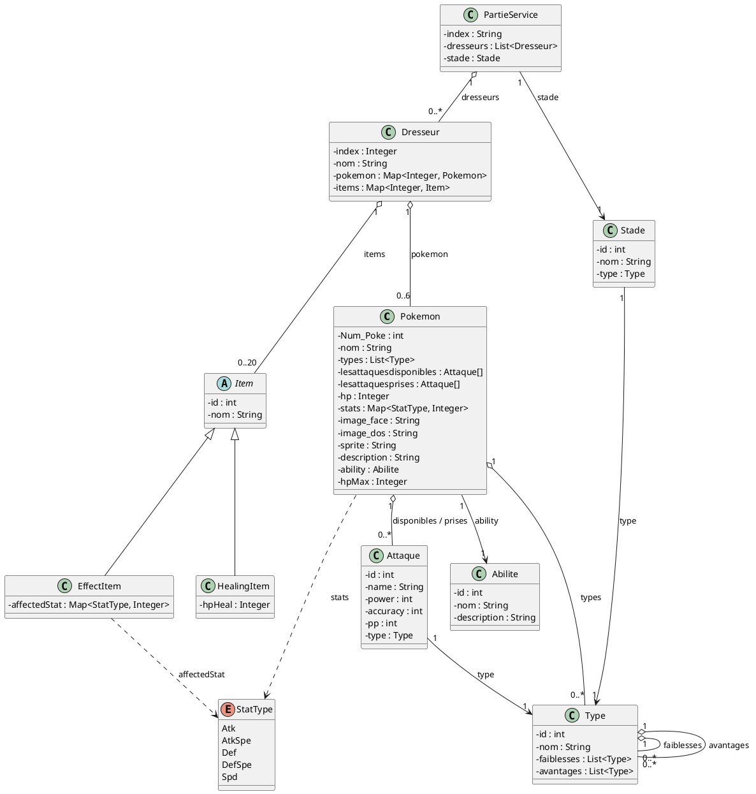

# Document de réversibilité technique

> Ce document est destiné à l'équipe qui reprendra la maintenance du projet. Soyez honnêtes et exhaustifs. Pas d'enjolivement.

## Architecture actuelle

<!-- Diagramme de classes ou de composants reflétant l'état RÉEL du code (pas la conception initiale). -->

**Flux d'exécution :**

1. `App` démarre l’application JavaFX, crée l’injecteur Guice puis lance `GameService.init(...)`.
2. `GameService` charge `index.fxml` : l’écran d’accueil s’affiche.
3. Quand le joueur clique sur **Start**, `IndexController.pressStartButton(...)` ouvre l’écran de sélection d’équipe (`ChooseTeam.fxml`) et initialise un `Dresseur` vide.
4. Dans `ChooseTeamController`, le joueur choisit ses Pokémon et renseigne éventuellement son nom ; le tableau des Pokémon est chargé depuis la base via `PokemonDAO`.
5. Le bouton **Suivant** ouvre `ChooseItems.fxml` via `ChooseItemsController`, en réinjectant le même `Dresseur`.
6. Dans `ChooseItemsController`, les items sont chargés depuis la base (`HealingItemDAO` et `EffectItemDAO`), puis ajoutés au sac du dresseur.
7. Le bouton **Héberger une partie** valide le premier dresseur local : son équipe et ses items sont enregistrés, puis l’écran prépare la suite du parcours.
8. Le bouton **Rejoindre une partie** valide le second dresseur local : la même logique s’applique, puis le combat peut être lancé quand les deux équipes sont prêtes.
9. Les anciennes briques liées à la connexion (`ConnectionService`, `HostGameCommand`, `ConnectCommand`, `MessageStore`, observers) restent présentes dans le projet, mais le flux principal actuel est local et ne dépend pas d’un serveur externe.
10. Quand `Partie` contient les deux dresseurs et leurs Pokémon actifs, `BattleController.initialize(...)` affiche l’interface de combat et initialise le tour courant.
11. Pendant le combat, `BattleController` lit l’état de `Partie`, appelle `PartieService` pour les attaques/changements de Pokémon, puis rafraîchit l’UI.

> Remarque : le flux de chargement intermédiaire `Chargement.fxml` existe dans le projet, mais il n’est pas utilisé par le chemin runtime principal actuel.

## Limitations techniques

- Le livrable final est centré sur une partie locale à deux joueurs.
- Les classes et commandes liées au réseau sont encore présentes, mais elles ne constituent plus le parcours principal.
- Certaines traces de l’ancien flux en ligne peuvent encore apparaître dans le code ou l’UI tant qu’elles n’ont pas été renommées.

## Bugs connus

<!-- Listez tous les bugs identifiés, même mineurs. Précisez les conditions de reproduction. -->

| Bug                                                                                                                                                                 | Sévérité | Conditions de reproduction                                                                                                                                   |
|---------------------------------------------------------------------------------------------------------------------------------------------------------------------|----------|--------------------------------------------------------------------------------------------------------------------------------------------------------------|
| Lorsque le pokémon n'a plus de vie, il n'est pas considérée comme K.O                                                                                               | Majeure  | Lors d'un combat, affaiblisser l'un des pokémons qui est en combat et lorsque le pokemon atteint les HP 0 le pokémon reste sur place et peut encore attaquer |
| On ne peut pas utiliser des items                                                                                                                                   | Majeure  | Appuyer sur "Sac"                                                                                                                                            |
| La mort d'un pokémon entraine la mort de son doublon dans l'équipe (si le dresseur a sélectionné plusieurs fois le même pokémon)                                    | Majeure  | Sélectionner un pokémon et le mettre plusieurs fois dans l'équipe, lors du combat mettre K.O un des pokémons et essayer de changer par un de ces doublons    |
| Lorsque l'on essaie de remplacer un pokémon par-dessus un autre le "slot" se vide. Il faudra rappuyer sur le slot vide pour le rajouter (Attaques sont enregistrés) | Mineure  | Appuyer sur un pokémon, choisir un slot remplit par un autre pokémon, choisir ses attaques et appuyer sur Valider                                            |
| Les boutons "Héberger une partie" et "Rejoindre une partie" configure les joueurs 1 et joueurs 2                                                                    | Mineure  | Aller sur Choisir les items                                                                                                                                  |
| Lancer un combat de pokémon sans Pokémon                                                                                                                            | Majeure  | Lors de la sélection des pokémons appuyer directement sur "Choisir ses items" et lancer un combat, le combat sera déjà déclaré comme forfait                 |

## Limitations techniques
- Le projet est actuellement limité à une partie locale à deux joueurs. Les classes liées au réseau sont présentes mais non utilisées.
- Le projet est conçu pour un usage desktop JavaFX, il n’est pas responsive ni adapté au mobile
- L’architecture actuelle mélange parfois la logique métier et la présentation (ex : `BattleController` gère à la fois les règles de combat et l’affichage), ce qui peut rendre les évolutions plus complexes.
- Le projet ne gère pas encore les sauvegardes de parties, ni les profils de joueurs, ce qui limite l’expérience utilisateur à une session unique sans historique.
- Le projet ne dispose pas d’une suite de tests automatisés, ce qui rend la validation des changements plus risquée et laborieuse.
- Le projet ne gère pas les animations ou les effets visuels pendant le combat, ce qui peut rendre l’expérience moins immersive.
- Le projet ne gère pas les différentes générations de Pokémon, ni les mécaniques avancées (ex : talents, météo, terrains), ce qui limite la profondeur stratégique du combat.

## Points de vigilance pour la reprise
- Ne pas Changer `App.java` 

## Améliorations recommandées

| Amélioration                                     | Difficulté   | Justification                                                                                                                                                                                                                                                                                                                                                                                                                                                                                    |
|--------------------------------------------------|--------------|--------------------------------------------------------------------------------------------------------------------------------------------------------------------------------------------------------------------------------------------------------------------------------------------------------------------------------------------------------------------------------------------------------------------------------------------------------------------------------------------------|
| Mettre un mode en ligne                          | Moyen        | Instaurer un système de bus où chaque joueurs envoie en json un model qui est soi Partie (pour héberger / rejoindre une partie), ou envoyer des mouvements en combat (Attaque, Sac etc.)                                                                                                                                                                                                                                                                                                         |
| Recherche de pokémon                             | Facile       | Instaurer un moteur de recherche lors de la sélection de pokémon                                                                                                                                                                                                                                                                                                                                                                                                                                 |
| Recherche de d'attaques de pokémon               | Facile       | Instaurer un moteur de recherche lors de la sélection des attaques                                                                                                                                                                                                                                                                                                                                                                                                                               |
| Recherche d'items                                | Facile       | Instaurer un moteur de recherche lors de la sélection des items                                                                                                                                                                                                                                                                                                                                                                                                                                  |
| Ajouter des pokémons dans la base de donnée      | Difficile    | Ajouter des pokémons en dur dans la base de donnée que seul les développeurs peuvent faire, faire une fonction permettant d'ajouter un ou plusieurs pokémons dans la base de donnée                                                                                                                                                                                                                                                                                                              |
| Faire une fusion de pokémon ou créer des pokémon | Difficile    | Faire des pages permettant de créer des pokémons et/ou de fusionner des pokémons, possibilité aussi "d'importer" des pokémons                                                                                                                                                                                                                                                                                                                                                                    |
| Demander une revanche                            | Difficile    | Ajouter un bouton à la fin du combat pour soit quitter, soit refaire un combat et attendre la réponse de l'adversaire.                                                                                                                                                                                                                                                                                                                                                                           |
| Afficher les items sélectionnés dans le sac      | Facile       | Faire une page à côté listant tous les items sélectionnées et leur nombres, possibilités de supprimer un items dans le sac ou d'enlever une certaine quantité                                                                                                                                                                                                                                                                                                                                    |
| Ajouter un nom par défaut pour le joueur 1       | Facile       | Mettre dans le .fxml le nom par défaut                                                                                                                                                                                                                                                                                                                                                                                                                                                           |
| Mettre plusieurs modes "Hors ligne", "En ligne"  | Difficile    | Ajouter un .fxml demandant de jouer Hors ligne (partie déjà développé), ou de joueur en Ligne (Partie du code en développement), à implémenter après avoir fait "Mettre en ligne"                                                                                                                                                                                                                                                                                                                |
| Faire un système de combat 2v2                   | Difficile    | Faire d'autres controllers/fxml/réajuster Partie,Dresseur, pour les combats de 2 pokémon contre 2 pokémons pour 2 dresseurs, ou 2 pokémon contre 2 pokémons pour 4 dresseurs                                                                                                                                                                                                                                                                                                                     |
| Régler les bugs de changement de pokemon         | Facile/Moyen | Lorsque un même pokemon se retrouve deux fois dans la même équipe (plusieurs pikachus, ce qui a du sens puisque "Pikachu" est une espèce de pokemon, il y a donc plusieurs individus), le système confond les deux car ils ont le même Poke_ID, ce qui mène à des bugs (ex : impossibilité de mettre un pikachu en pokemon actif lorsqu'un autre pikachu de l'équipe est KO). Il faudra assigner un id unique par pokemon dans l'équipe, ou utiliser l'index dans la liste pour les différencier |
