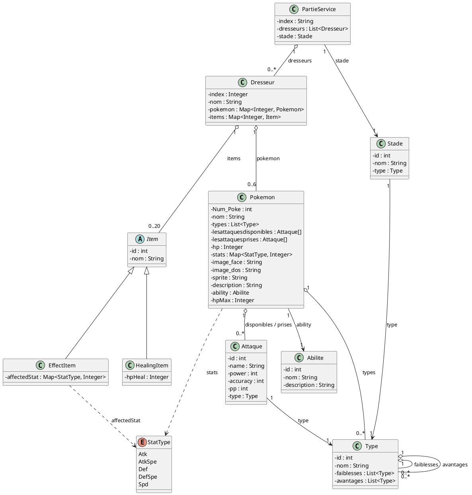

# Document de réversibilité technique

> Ce document est destiné à l'équipe qui reprendra la maintenance du projet. Soyez honnêtes et exhaustifs. Pas d'enjolivement.

## Architecture actuelle

<!-- Diagramme de classes ou de composants reflétant l'état RÉEL du code (pas la conception initiale). -->

**Flux d'exécution :**

## Bugs connus

<!-- Listez tous les bugs identifiés, même mineurs. Précisez les conditions de reproduction. -->

| Bug                                                                                                                                                                 | Sévérité | Conditions de reproduction                                                                                                                                   |
|---------------------------------------------------------------------------------------------------------------------------------------------------------------------|----------|--------------------------------------------------------------------------------------------------------------------------------------------------------------|
| Lorsque le pokémon n'a plus de vie, il n'est pas considérée comme K.O                                                                                               | Majeure  | Lors d'un combat, affaiblisser l'un des pokémons qui est en combat et lorsque le pokemon atteint les HP 0 le pokémon reste sur place et peut encore attaquer |
| Ne peut pas quitter le combat                                                                                                                                       | Majeure  | Appuyer sur "Fuire" lors d'un combat                                                                                                                         |
| On ne peut pas utiliser des items                                                                                                                                   | Majeure  | Appuyer sur "Sac"                                                                                                                                            |
| Lorsque l'on essaie de remplacer un pokémon par-dessus un autre le "slot" se vide. Il faudra rappuyer sur le slot vide pour le rajouter (Attaques sont enregistrés) | Mineure  | Appuyer sur un pokémon, choisir un slot remplit par un autre pokémon, choisir ses attaques et appuyer sur Valider                                            |
| Les boutons "Héberger une partie" et "Rejoindre une partie" configure les joueurs 1 et joueurs 2                                                                    | Mineure  | Aller sur Choisir les items                                                                                                                                  |

## Limitations techniques

<!-- Ce qui ne fonctionne pas ou fonctionne PartieServicellement. -->

## Points de vigilance pour la reprise

<!-- Ce qu'un développeur reprenant le projet doit absolument savoir. -->

## Améliorations recommandées

| Amélioration            | Difficulté | Justification |
|-------------------------|------------|---------------|
| Mettre un mode en ligne | Moyen      | Possible      |
|  | Moyen      |               |

